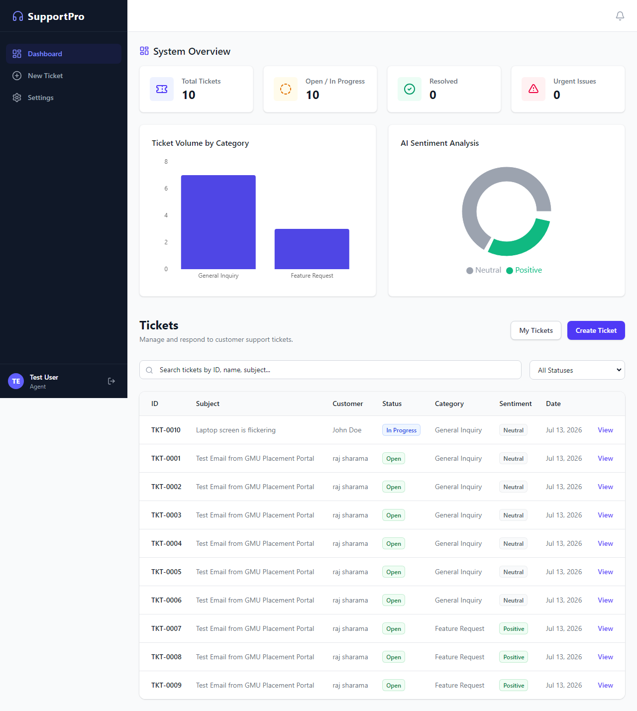
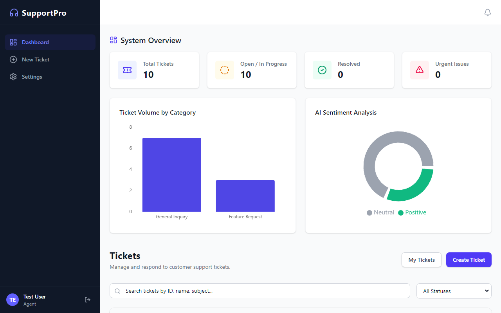
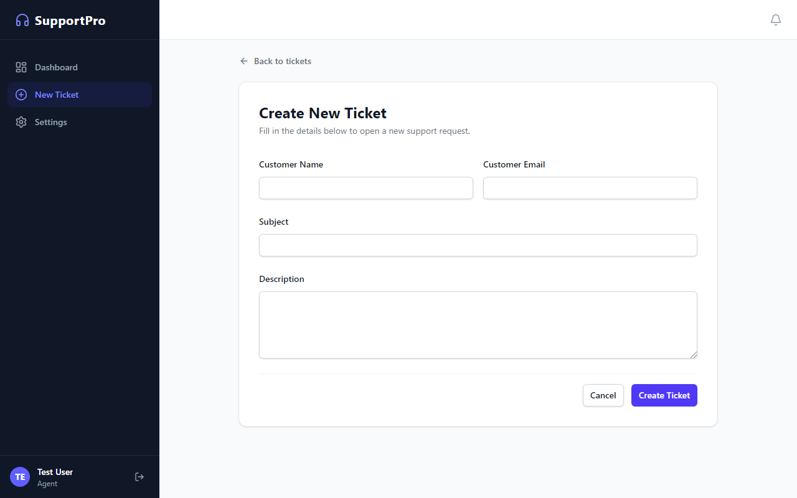
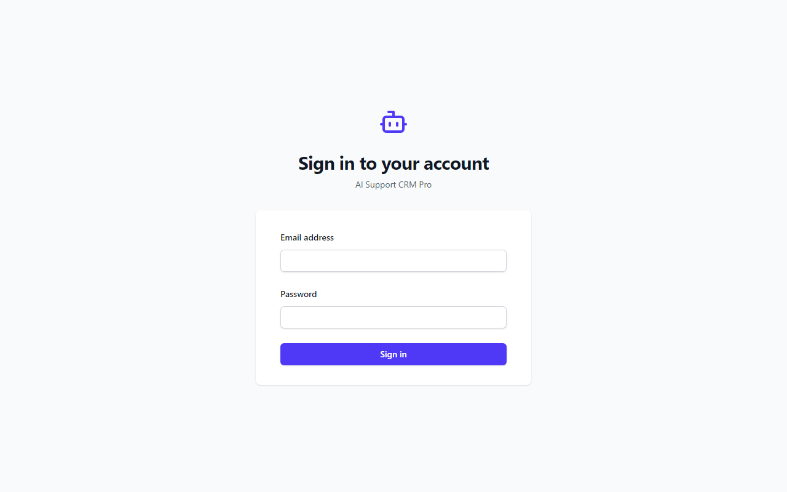

# AI Support CRM Pro

> A full-stack AI-powered Customer Support CRM built with FastAPI, React, and OpenAI. Developed as a production-ready MVP for the Datastraw AI Tech Internship Assessment.

---

# Project Overview

AI Support CRM Pro is a modern customer support ticket management system that enables support teams to create, manage, search, and resolve customer tickets efficiently.

The project demonstrates end-to-end full-stack development, including database design, REST API development, authentication, responsive frontend development, AI integration, automated testing, and cloud deployment.

Beyond the required CRM functionality, the application includes optional AI-powered features such as automated ticket categorization, sentiment analysis, and intelligent fallback handling.

---

# Features

## Core CRM Features

- Create customer support tickets
- Auto-generated Ticket IDs (e.g., TKT-0001)
- Customer information management
- Ticket search across multiple fields
- Status filtering (Open, In Progress, Closed)
- Ticket detail page
- Internal notes/comments
- Ticket assignment
- Dashboard with ticket statistics
- Responsive user interface

---

## AI Features

The application integrates the OpenAI API to analyze support tickets.

Supported AI capabilities include:

- Automated ticket categorization
- Customer sentiment analysis
- Intelligent fallback logic when the AI service is unavailable or quota is exceeded

The CRM remains fully functional even if AI services are unavailable.

---

## Security

- JWT Authentication
- Password hashing with bcrypt
- Protected API routes
- Environment-based configuration
- Secure password storage

---

# Architecture

```text
                 React Frontend
                        │
                     Axios
                        │
              FastAPI REST API
                        │
        Authentication & Validation
         (JWT + Pydantic + Dependencies)
                        │
          CRUD / Business Service Layer
               ┌────────┴─────────┐
               │                  │
        SQLAlchemy ORM      AI Service Layer
               │                  │
            SQLite DB        OpenAI API
```

The application follows a layered architecture with clear separation between presentation, API, business logic, and persistence.

---

# Technology Stack

## Backend

- FastAPI
- SQLAlchemy
- SQLite
- Pydantic v2
- JWT Authentication
- bcrypt
- Python

## Frontend

- React 18
- TypeScript
- Vite
- Tailwind CSS
- Axios
- Recharts

## AI

- OpenAI Python SDK
- Async API integration
- Graceful fallback handling

## Testing

- Pytest
- FastAPI TestClient

## Deployment

- Railway
- Vercel

---

# Project Structure

```text
AI-Support-CRM-Pro/

backend/
│
├── app/
│   ├── api/
│   ├── core/
│   ├── crud/
│   ├── database/
│   ├── models/
│   ├── schemas/
│   ├── services/
│   ├── utils/
│   └── main.py
│
├── tests/
│
├── requirements.txt
└── .env.example

frontend/
│
├── src/
│   ├── components/
│   ├── pages/
│   ├── api/
│   ├── context/
│   ├── hooks/
│   ├── types/
│   └── App.tsx
│
├── package.json
└── vite.config.ts
```

---

# Installation

## Backend

```bash
cd backend

python -m venv venv

venv\Scripts\activate

pip install -r requirements.txt

copy .env.example .env

# Add your OpenAI API key

uvicorn app.main:app --reload
```

---

## Frontend

```bash
cd frontend

npm install

npm run dev
```

---

# Running Tests

Run backend integration tests:

```bash
cd backend

$env:PYTHONPATH="."

pytest -v
```

Included tests:

- Health Endpoint
- Create Ticket
- Get Ticket
- Update Ticket
- Validation
- Invalid Ticket Handling

---

# API Endpoints

| Method | Endpoint | Description |
|---------|----------|-------------|
| POST | `/api/v1/auth/register` | Register new user |
| POST | `/api/v1/auth/login` | Login and obtain JWT |
| GET | `/api/v1/tickets` | List tickets |
| POST | `/api/v1/tickets` | Create ticket |
| GET | `/api/v1/tickets/{ticket_id}` | Get ticket details |
| PUT | `/api/v1/tickets/{ticket_id}` | Update ticket |
| POST | `/api/v1/tickets/{ticket_id}/notes` | Add note |
| GET | `/api/v1/analytics/summary` | Dashboard analytics |

---

# AI Workflow

When a ticket is created:

```text
User Creates Ticket
        │
        ▼
Ticket Saved to Database
        │
        ▼
AI Service (OpenAI)
        │
        ├── Category
        ├── Sentiment
        └── Priority Analysis
        │
        ▼
Update Ticket Metadata
```

If the OpenAI API is unavailable or exceeds its quota, the application automatically switches to rule-based fallback logic, ensuring uninterrupted CRM functionality.

---

# Deployment

Backend

- Railway

Frontend

- Vercel

Environment variables are managed securely using `.env` files.

---

# Screenshots

Here is a visual overview of the AI Support CRM Pro in action:

### 1. Dashboard & Ticket Management


### 2. Analytics Dashboard


### 3. Create Ticket (with AI Integration)


### 4. Ticket Details & Notes


### 5. Secure Login


---

# Future Improvements

- PostgreSQL support
- Redis caching
- WebSocket real-time updates
- Email notifications
- File attachments
- Docker & Docker Compose
- CI/CD with GitHub Actions
- Frontend unit testing with Vitest

---

# Assignment Coverage

This project satisfies all required features from the Datastraw AI Tech Internship assessment.

| Requirement | Status |
|-------------|--------|
| Create Ticket | ✅ |
| Ticket List | ✅ |
| Search | ✅ |
| Filter | ✅ |
| Ticket Details | ✅ |
| Update Status | ✅ |
| Notes | ✅ |
| REST API | ✅ |
| Database | ✅ |
| Responsive Frontend | ✅ |
| Deployment | ✅ |
| GitHub Repository | ✅ |
| Demo Ready | ✅ |

---

# Author

**Kiran Sindagi**

AI/ML Engineer | Full Stack Developer

GitHub: https://github.com/Kiransindagi

LinkedIn: *(Add your LinkedIn URL here)*